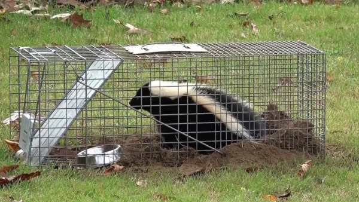
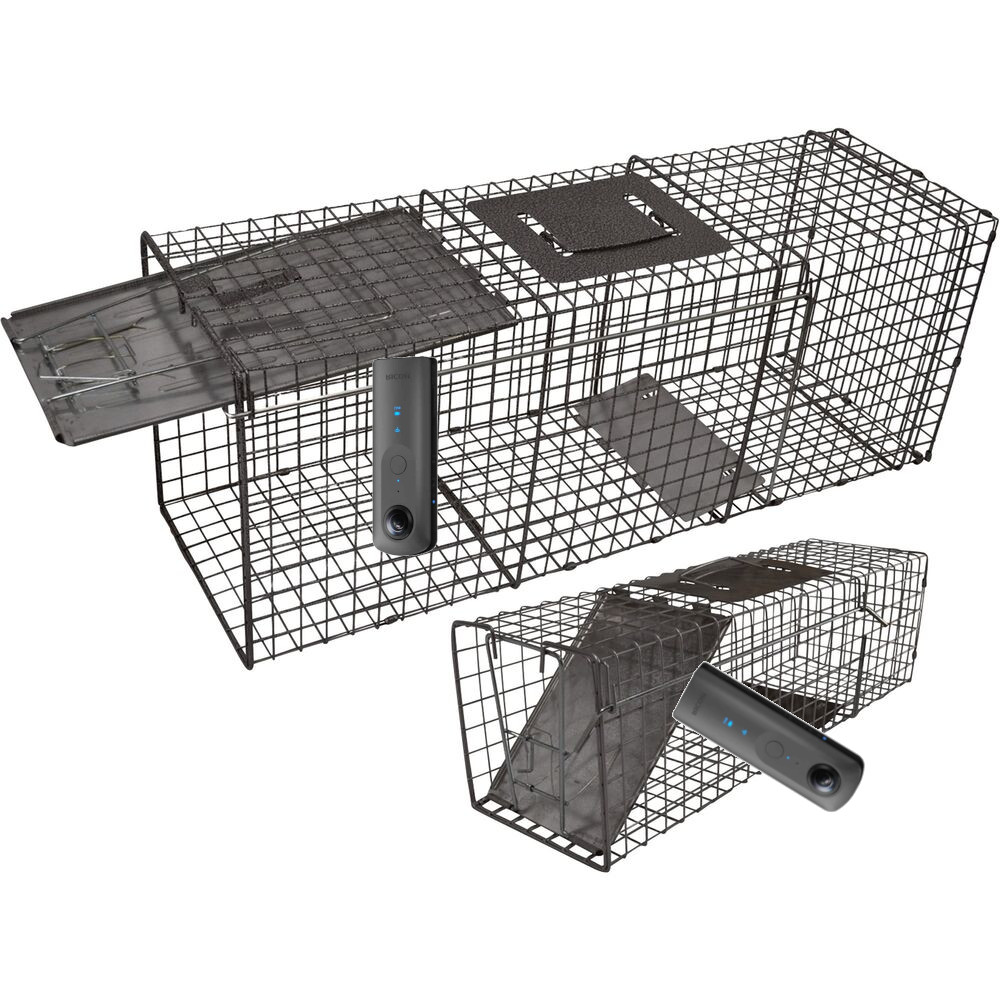

# Skunk Trap Troubleshooter

Thanks to  [KAZ](https://twitter.com/yokazuya_jp) for a great article on
this subject [in Japanese](https://qiita.com/yokazuya/items/f36e5a2252bf32b0c18b).

## Usage

* Drill hole in trap cover to allow 1/4" by 20tpi bolt to pass through
* Use extension to enable THETA to be powered by USB cable
* Mount THETA upside down on the trap door

Picture will trigger once THETA is moved by either pitch or roll by a 
threshold.  Currently set to +/- 0.8.
